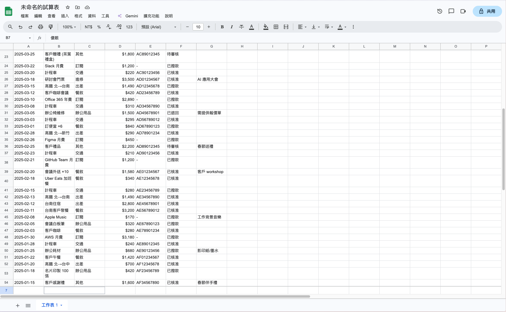

<div align="center">

# 📊 sheetchat

**A real-time chat that looks _exactly_ like Google Sheets.**
When your boss walks by, it's still a spreadsheet.

<sub>Built with vanilla JS + Firebase · No build step · No tracking · Free to host</sub>



<sub><i>What your boss sees. Click any cell, and it's a chat.</i></sub>

</div>

---

## Why?

Slack is blocked. Discord is suspicious. LINE is too obvious. But nobody questions a spreadsheet.

**sheetchat** is a pixel-perfect Google Sheets clone that secretly carries a real-time group chat. One click flips between the disguise and the conversation. Walk away from the keyboard for 10 seconds, and it flips back on its own. Even the desktop notifications pretend to be Google Drive sync alerts.

## ✨ Features

### 🕵️ The disguise
- **Pixel-perfect Sheets UI** — title bar, menus, toolbar, formula bar, column/row headers, sheet tab. The browser tab even says _Untitled spreadsheet - Google Sheets_ (or _未命名的試算表_ in Chinese).
- **Multiple fake datasets** — expense report, hiring tracker, A/R aging. Switch via the **Data** menu.
- **Bilingual** — auto-detects browser language (zh-TW / English) so UI, mock data, and notifications all match. Manual switch in **File → Language**.
- **Auto-cloak**:
  - Click the cell → real conversation fades in
  - 10 s of inactivity (configurable) → fades back to fake data
  - Click _anywhere_ outside the cell (menu, toolbar, sheet tab) → instant disguise
  - Switch browser tabs → instant disguise

### 💬 The chat
- **Real-time multi-user** — Firestore sync, no refresh needed
- **One column per friend** (A, B, C…) — assigned automatically, sticky across sessions
- **Formula bar shows the latest message** when you're not typing, mirroring Sheets' "fx" behavior
- **Images & links, the Sheets way** — Cmd/Ctrl+V pastes any image as a discreet `[Image]` link; long URLs auto-shorten to `https://example.com/…path/file.html`. Both render as **underlined black text** — never blue — so they blend straight into the spreadsheet.
- **Cells wrap & grow** when messages overflow
- **IME-safe** — Chinese / Japanese / Korean composition is fully respected; Enter mid-composition won't mis-send

### 🔔 Subtle notifications
- **Off by default.** Opt in via **File → Settings**.
- **Disguised desktop notification** — title and body look exactly like a Google Drive sync alert (_"Drive sync complete"_), not a chat ping
- **Soft chime** option for sound — short, single tone, easy to ignore
- **Rate-limited** to one notification per 10 s so a chatty group doesn't blow your cover
- **Only fires when you're away** — current tab + active chat = silent

### 🚪 Rooms
- **6-char short codes** in the URL — share-friendly
- **One-click invite** — "Share" button copies the link
- **Inline welcome** — friends opening your link land straight in the room with a nickname prompt
- **Recent rooms** — lobby shows the last 5 you joined
- **Optional room password** for the paranoid

### 🧹 Daily reset
- **Every message auto-deletes at midnight** via Firestore TTL
- Room and column assignments **persist** — same link, same seat tomorrow

---

## 🚀 Quick start

You'll need a free [Firebase](https://firebase.google.com) project.

```bash
git clone <this-repo>
cd sheetchat

# Copy the config templates and fill in your Firebase values
cp src/firebase-config.example.js src/firebase-config.js
cp .firebaserc.example .firebaserc

# Run locally — pure static site, any HTTP server works
python3 -m http.server 8000
open http://localhost:8000

# Deploy
npm i -g firebase-tools
firebase login
firebase deploy
```

## 🔧 Firebase one-time setup

In the [Firebase Console](https://console.firebase.google.com):

1. **Create a project**
2. **Enable Firestore Database** (production mode)
3. **Firestore → Rules** — paste:
   ```js
   rules_version = '2';
   service cloud.firestore {
     match /databases/{database}/documents {
       match /rooms/{roomId} {
         allow read, write: if true;
         match /{document=**} {
           allow read, write: if true;
         }
       }
     }
   }
   ```
4. **Firestore → TTL** — create a policy on collection group `messages`, field `expiresAt` (this is what wipes the chat at midnight)
5. **Project settings → Your apps** — register a Web app and paste the SDK config into `src/firebase-config.js`

> The Firebase Web SDK `apiKey` is public by design — security is enforced via Firestore Rules, not the key.

---

## 🏗️ How it works

- **Pure static site** — HTML / CSS / vanilla JS, no bundler, no framework
- **Firestore** for real-time sync
- **Firestore TTL** for the daily wipe
- **localStorage** for nickname, recent rooms, selected disguise theme, language, and notification settings
- **Web Audio API** for the optional soft chime — no audio assets to ship

### Data model

```
rooms/{roomId}                    # room (persists)
  ├─ passwordHash?                # optional, SHA-256 salted with roomId
  ├─ users/{nickname}             # user (persists — remembers column + color)
  └─ messages/{auto-id}           # messages (auto-deleted at midnight)
       ├─ author
       ├─ column: 'A' | 'B' | ...
       ├─ text                    # may be empty if image-only
       ├─ image?                  # base64 data URL (compressed, < 900 KB)
       ├─ createdAt
       └─ expiresAt: next 00:00
```

---

## 🤝 Contributing

Issues and PRs welcome. Keep it vanilla — no build step, no framework, no dependencies beyond Firebase.

## 📄 License

MIT
